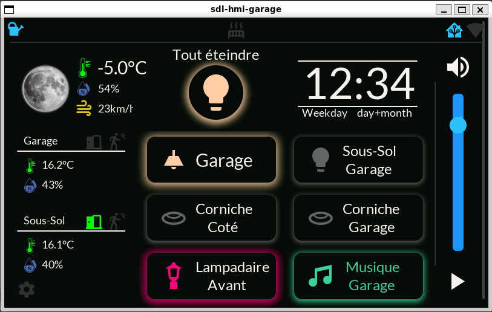

# ESP32-S3-Touch-LCD-7 ESPHOME LVGL HMI

HMI developed through ESPHome's framework with heavy use of lvgl.

Used to display sensor data and control lights through Home Assistant. All for devices relevant to the area where this device is installed in my house. At my front house's door.

This project is very much tailored to my needs but could serve as a base for anyone willing to do something similar.

This HMI is used to:

- Display local weather data
- Display indoor temperature/humidity/Air quality from living room.
- Display river's height and flow data
- Control lights outdoor, in the front.
- Lock/unlock side door
- Open close curtains in living room
- Display a couple notification icons. If plant needs watering, side or back door opened, etc.
- Display API connection status to Home Assistant.
- Display wifi signal strength.
- Shows a contextual button to turn off all lights. Useful when leaving the house.
- Control Music volume/mute and play/pause status.
- Sub page to control RGBCT lights. Switch between color_temp and rgb mode. Activate effects, pick color/temperature. WIP.
- Sub page for music control. Skip next/previous tracks. Media info. More to come. WIP.

## Project structure

- hmi-entree.yaml: top-level ESPHome project for the Waveshare ESP32-S3-Touch-LCD-7
- hmi-entree-sdl.yaml: top-level ESPHome project running on [Host platform](https://esphome.io/components/host.html)
- hmi-entree folder: ESPHome code for the HMI
- case folder: design for 3D printed wall-mountable case
- extras/home_assistant_stuff folder: Home assistant-related automations, scripts and entities. See [README](extras/home_assistant_stuff/README.md).
- extras/ser2net folder: ESPHome Yaml config for a ser2net device to interface the LCD's uart port. Script for socat. See [README](extras/ser2net/README.md).

## Notes on project

This is still very much in active development. In fact, some planned features are disabled due to issues with ESPHome's framework that need to be addressed.

Things are subject to change.

As it stands now, the standard flash partition size is almost full. 

As the Waveshare's ESP32-S3-Touch-LCD-7 uses a 8MB flash WROOM module, you get a little under 4MB of flash space for your program following standard ESPHome's standard partition scheme.

This project could benefit from optimization but I'm not an expert in the matter.

If it comes to it, there is a way to forgo standard partition scheme and use most of the 8MB flash space for the entire program. The drawback is losing the ability to do OTAs. Then it becomes necessary to update the device through its uart. There is a way to connect a second ESPHome device to the uart and use a custom "ser2net" component to pipe a serial interface over wifi. It then becomes possible to flash the device using esptool programming tool to perform a sort of OTA but with more manual steps involved.

I pre-emptively already installed an ESP32-C3 board and connected it to the UART terminal of the Waveshare in case I ever need to hard flash it through the bootloader.

I also soldered wires RESET and BOOT0 signals of the ESP32-S3 form the LCD module to GPIOs of the ESP32-C3. 

Refer to the [ser2net's folder README](extras/ser2net/README.md) for more info.

For the time being, this project still fits in the standard partition scheme so this is not required.

## Notes on development

This project is split into multiple files. Usage of an IDE like Visual Studio Code is strongly recommended, if not downright necessary.

There is a secondary ESPHome project using SDL2 platform to test changes made in LVGL instead of flashing over and over a real device. 

This requires [manually installing ESPHome](https://esphome.io/guides/installing_esphome.html) as well as a few other dependencies.
More info on how to setup a dev environnement on your PC is coming. In the meantime, check out this forum thread: https://community.home-assistant.io/t/how-to-virtual-esphome-device-and-development-using-windows-work-in-progress/802669/2

# 3D printable wall-mountable case

The [case folder](case) has a STL file for a wall-mountable case. See folder's [README](case/README.md) for more info.

# TODO

- Fix online_image to retrieve background
  - Waiting on PR https://github.com/esphome/esphome/pull/8354
  - Or load it from SD card if storage support in ESPHome is ever integrated
- Fix online_image to retrieve media cover art from Music Assistant
  - Waiting on PR https://github.com/esphome/esphome/pull/8354
- Send values for entities controlled through Arc and Slider while they are interfaced
  - AKA do not use "on_release" automation trigger
  - Using "on_change" trigger automation would tank performance and spam the network continously.
- (Optional)Turn required HA automation into a blueprint
- Remove Host's http_request External_component PR once merged
  - https://github.com/esphome/esphome/pull/8040

## Thanks

For the awesome framework to easily create connected devices
https://esphome.io/

For getting me started and for animated weather effects
https://github.com/alaltitov/display/tree/main

For the info on how to set-up a PC simulator environment
https://community.home-assistant.io/t/how-to-virtual-esphome-device-and-development-using-windows-work-in-progress/802669

Dimmable backlight mod using a GPIO on the ESP32-S3
https://community.home-assistant.io/t/esp32-s3-7inch-capacitive-touch-display-adjust-brightness/771030/17

SergeyMorozov for the original wall-mountable case design and supplying the source design for my modification
https://www.thingiverse.com/thing:6701545

Oxan for the ESPHome ser2net component
https://github.com/oxan/esphome-stream-server
