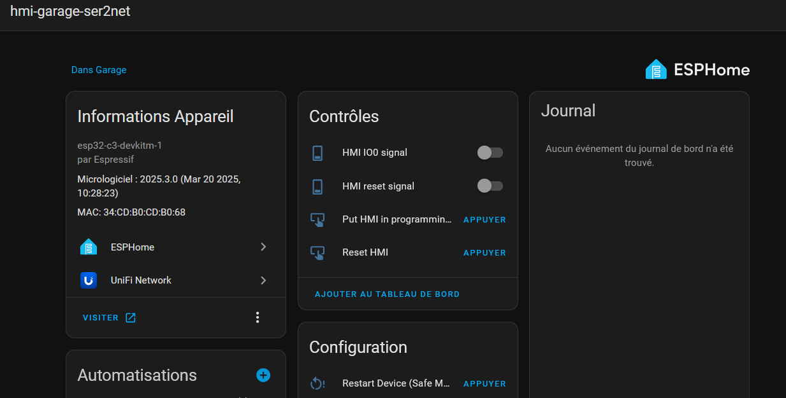

# Ser2net ESPHome project

ESPHome's yaml file for the ESP32-C3 in charge of exposing the ser2net interface.
Using [oxan's ser2net](https://github.com/oxan/esphome-stream-server) esphome component
It's also used as a BLE proxy while there are no active serial connection.

[Example script](connect_socat.sh) is to connect to ser2net interface on your computer. Linux/Mac and Windows through WSL. Requires socat. 

I haven't found a way to bind DTR and RTS lines to the ser2net socat interface to automatically put the Waveshare's ESP32-S3 in bootloader mode. Limitation of the ESPHome's ser2net custom component most definitely and probably some configuration missing in the socat invoke command. You will need to manually put it in using the exposed buttons from the ESPHome's device page of the ESP32-C3 in Home Assistant. 

Then you will need to manually invoke esptool.py using `no_reset` for both reset options in the command line. If you try to "upload" your project through ESPHome's CLI by supplying the socat tty interface, ESPHome will generate a sample esptool command to invoke manually after failing to trigger bootloader mode on the Waveshare. You just need to replace the "reset" statements with the `no_reset` arguments as instructed above. It works but it's slow as the tty interfaced is capped at 115200 bps (ser2net custom component limitation?).

You can also get uart logs through this. Useful if you have crashes. Is also less ressource-intensive for the Waveshare's ESP32-S3 than sending logs through network.

